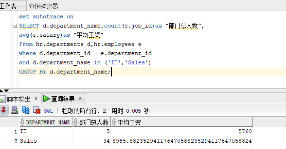
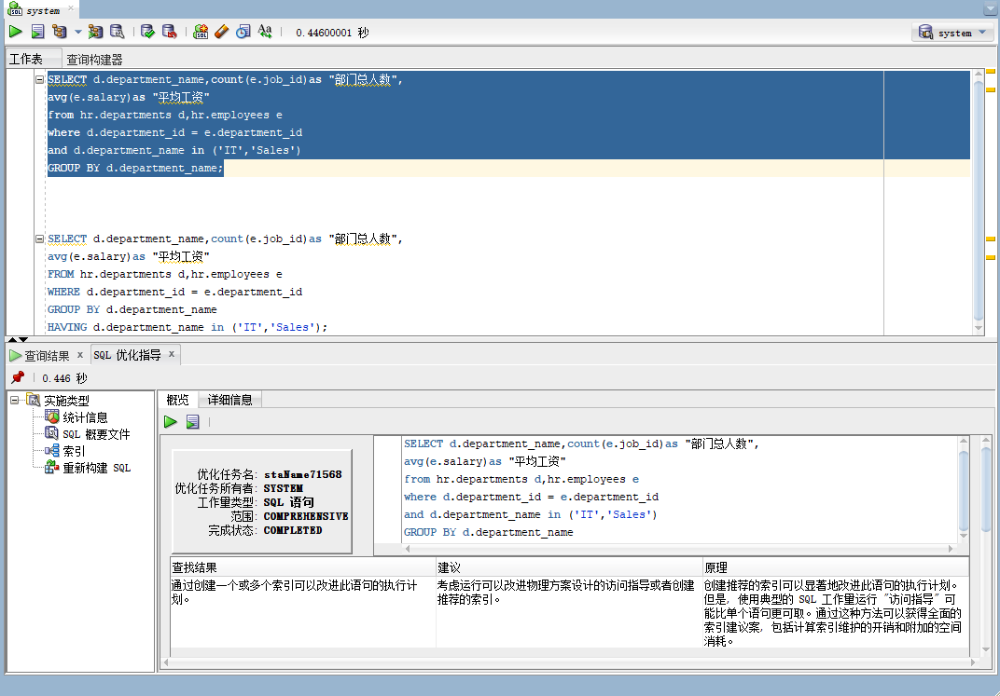
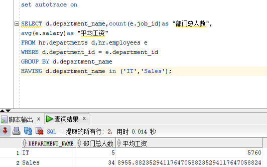
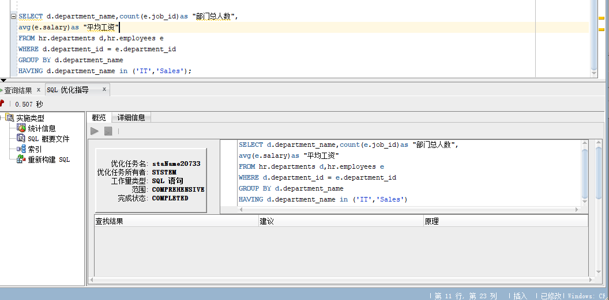
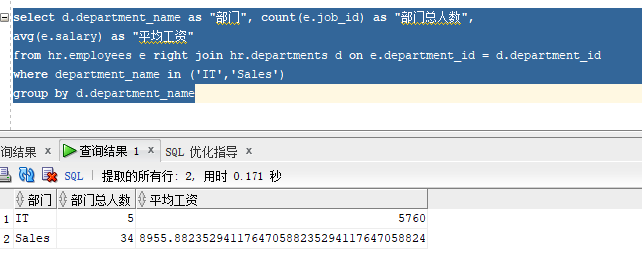

# 实验1：SQL语句的执行计划分析与优化指导

## 软工四班-张剑峰-201810513329

## 1、实验目的

  分析SQL执行计划，执行SQL语句的优化指导。理解分析SQL语句的执行计划的重要作用。
  
## 2、实验内容

- 对Oracle12c中的HR人力资源管理系统中的表进行查询与分析。
- 首先运行和分析教材中的样例：本训练任务目的是查询两个部门('IT'和'Sales')的部门总人数和平均工资，以下两个查询的结果是一样的。但效率不相同。
- 设计自己的查询语句，并作相应的分析，查询语句不能太简单。

## 3、教材中的查询语句

- 查询1：

```SQL
set autotrace on

SELECT d.department_name,count(e.job_id)as "部门总人数",
avg(e.salary)as "平均工资"
from hr.departments d,hr.employees e
where d.department_id = e.department_id
and d.department_name in ('IT','Sales')
GROUP BY d.department_name;
```

- **查询结果**


- **优化指导**
  


- 查询2

```SQL
set autotrace on

SELECT d.department_name,count(e.job_id)as "部门总人数",
avg(e.salary)as "平均工资"
FROM hr.departments d,hr.employees e
WHERE d.department_id = e.department_id
GROUP BY d.department_name
HAVING d.department_name in ('IT','Sales');
```

- **查询结果**


- **优化指导**
  


## 代码分析

_两个代码同样是对两个部门的总人数和平均工资进行的查询，但是第一种代码的花费时间明显少于第二种代码花费的时间。利用sqldeveloper的优化指导工具进行优化指导。第一个查询给出了优化指导该查询语句通过从两个部门来查询部门的总人数和平均工资，通过创建一个或多个索引可以改进此语句的执行计划。建议考虑运行可以改进物理方案设计的访问指导或者创建推荐的索引。原理是创建推荐的索引可以显著地改进此语句的执行计划。但是，使用典型的SQL工作量运行“访问指导”可能比单个语句更可取。通过这种方法可以获得全面的索引建议案，包括计算索引维护的开销和附加的空间消耗。_

## 4、设计自己的查询语句

```SQL
select d.department_name as "部门", count(e.job_id) as "部门总人数",
avg(e.salary) as "平均工资"
from hr.employees e right join hr.departments d on e.department_id = d.department_id
where department_name in ('IT','Sales')
group by d.department_name
```

- **查询结果**


- 分析：这次的查询语句是从员工表中读取平均工资和部门总人数，然后利用部门id通过左连接的方式来连接两个员工表和部门表中的内容，然后从中读取两个部门的总人数和平均工资。从运行结果中可以看出，花费的时间比教材中的第一种方式差，比第二种方式优。对于查询的优化，仍然是建立索引来达到优化的结果。
