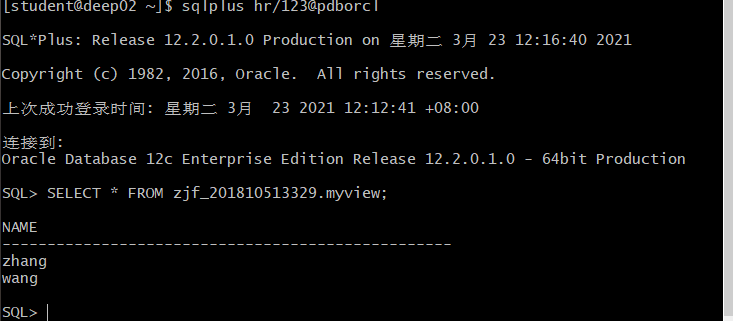

# 实验2：用户及权限管理

## 软工四班-张剑峰-201810513329

## 实验目的

掌握用户管理、角色管理、权根维护与分配的能力，掌握用户之间共享对象的操作技能。

## 实验内容

Oracle有一个开发者角色resource，可以创建表、过程、触发器等对象，但是不能创建视图。本训练要求：

- 在pdborcl插接式数据中创建一个新的本地角色con_res_view，该角色包含connect和resource角色，同时也包含CREATE VIEW权限，这样任何拥有con_res_view的用户就同时拥有这三种权限。
- 创建角色之后，再创建用户new_user，给用户分配表空间，设置限额为50M，授予con_res_view角色。
- 最后测试：用新用户new_user连接数据库、创建表，插入数据，创建视图，查询表和视图的数据。

## 实验步骤

- 1.登录数据库：

```sql
    # 连接数据库
    $ sqlplus system/123@pdborcl
```


- 2.创建角色

```sql
    # 创建自己的角色
    CREATE ROLE stu_zjf;
    # 给角色赋予connect和resource角色，同时也包含CREATE VIEW权限
    GRANT connect,resource,CREATE VIEW TO stu_zjf;
    # 创建用户
    CREATE USER zjf_201810513329 IDENTIFIED BY 123 DEFAULT TABLESPACE users TEMPORARY TABLESPACE temp;
    # 给用户分配50m表空间
    ALTER USER zjf_201810513329 QUOTA 50M ON users;
    # 给用户赋予角色
    GRANT stu_zjf TO zjf_201810513329;

```


- 3.新用户zjf_201810513329连接到pdborcl，创建表mytable和视图myview，插入数据，最后将myview的SELECT对象权限授予hr用户。

```sql
# 使用新用户登录
$ sqlplus zjf_201810513329/123@pdborcl
SQL> show user;
USER is "zjf_201810513329"
SQL> CREATE TABLE mytable (id number,name varchar(50));
Table created.
SQL> INSERT INTO mytable(id,name)VALUES(1,'zhang');
1 row created.
SQL> INSERT INTO mytable(id,name)VALUES (2,'wang');
1 row created.
SQL> CREATE VIEW myview AS SELECT name FROM mytable;
View created.
SQL> SELECT * FROM myview;
```


- 4.用户hr连接到pdborcl，查询zjf_201810513329授予它的视图myview

```sql
$ sqlplus hr/123@pdborcl
SQL> SELECT * FROM zjf_201810513329.myview;
NAME
--------------------------------------------------
zhang
wang
SQL> exit
```



## 查看数据库的使用情况

```sql
$ sqlplus system/123@pdborcl

SQL>SELECT tablespace_name,FILE_NAME,BYTES/1024/1024 MB,MAXBYTES/1024/1024 MAX_MB,autoextensible FROM dba_data_files  WHERE  tablespace_name='USERS';

SQL>SELECT a.tablespace_name "表空间名",Total/1024/1024 "大小MB",
 free/1024/1024 "剩余MB",( total - free )/1024/1024 "使用MB",
 Round(( total - free )/ total,4)* 100 "使用率%"
 from (SELECT tablespace_name,Sum(bytes)free
        FROM   dba_free_space group  BY tablespace_name)a,
       (SELECT tablespace_name,Sum(bytes)total FROM dba_data_files
        group  BY tablespace_name)b
 where  a.tablespace_name = b.tablespace_name;
```


## 实验总结

经过这次实验，我学习到了如何创建用户和角色，然后怎么去赋予角色一定的权限，该权限能够让新用户和角色在数据库中能进行查询、添加等操作，然后还学会了如何使用SQL语句查询数据库的使用情况。这些操作都是非常实用的，能够方便我们对数据库进行管理和赋予其他角色进行管理的操作。
