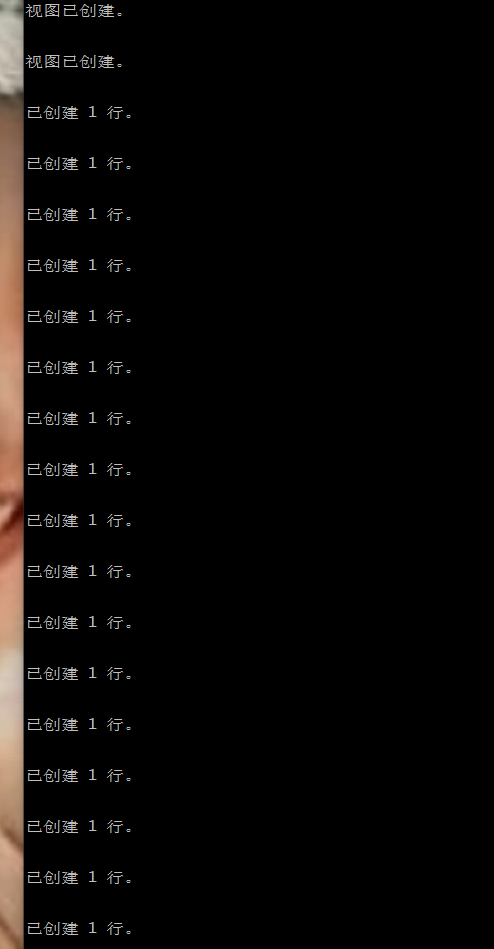

# 实验4：对象管理

##### 张剑峰，201810513329，18-软工（4）用户名：zjf_201810513329
---
## 实验目的：
了解Oracle表和视图的概念，学习使用SQL语句Create Table创建表，学习Select语句插入，修改，删除以及查询数据，学习使用SQL语句创建视图，学习部分存储过程和触发器的使用。

---
## 实验场景：
假设有一个生产某个产品的单位，单位接受网上订单进行产品的销售。通过实验模拟这个单位的部分信息：员工表，部门表，订单表，订单详单表。

---
## 实验内容：

### 录入数据：
要求至少有1万个订单，每个订单至少有4个详单。至少有两个部门，每个部门至少有1个员工，其中只有一个人没有领导，一个领导至少有一个下属，并且它的下属是另一个人的领导（比如A领导B，B领导C）。

### 序列的应用
插入ORDERS和ORDER_DETAILS 两个表的数据时，主键ORDERS.ORDER_ID, ORDER_DETAILS.ID的值必须通过序列SEQ_ORDER_ID和SEQ_ORDER_ID取得，不能手工输入一个数字。

### 触发器的应用：
维护ORDER_DETAILS的数据时（insert,delete,update）要同步更新ORDERS表订单应收货款ORDERS.Trade_Receivable的值。

```
1.查询某个员工的信息
2.递归查询某个员工及其所有下属，子下属员工。
3.查询订单表，并且包括订单的订单应收货款: Trade_Receivable= sum(订单详单表.ProductNum*订单详单表.ProductPrice)- Discount。
4.查询订单详表，要求显示订单的客户名称和客户电话，产品类型用汉字描述。
5.查询出所有空订单，即没有订单详单的订单。
6.查询部门表，同时显示部门的负责人姓名。
7.查询部门表，统计每个部门的销售总金额。
```

1.登录自己的账号，并运行test4.sql文件：
``` sql
sqlplus zjf_201810513329/123@localhost/pdborcl
@test4.sql
```





完成表单的创建和数据的插入。

2.进行查询：
``` sql
1.查询某个员工的信息
SELECT * FROM EMPLOYEES WHERE NAME LIKE '%白经理%';
```
查询结果：


``` sql
2.递归查询某个员工及其所有下属，子下属员工。
SELECT employee_id, name, manager_id, level, CONNECT_BY_ISLEAF  
FROM EMPLOYEES  START WITH employee_id = 12
CONNECT BY PRIOR employee_id = manager_id
order by level;
```
查询结果：


``` sql
3.查询订单表，并且包括订单的订单应收货款: Trade_Receivable= sum(订单详单表.ProductNum*订单详单表.ProductPrice)- Discount。
select * from ORDERS;
```
查询结果：


``` sql
4.查询订单详表，要求显示订单的客户名称和客户电话，产品类型用汉字描述。
select o.customer_name as 客户名称,o.customer_tel as 客户电话, p.product_type as 产品类型
from orders o,order_details d,products p
where o.order_id = d.order_id and d.product_name = p.product_name;
```

查询结果：


``` sql
5.查询出所有空订单，即没有订单详单的订单。
select * from ORDERS where ORDER_ID not in(select distinct ORDER_ID from ORDER_DETAILS); 
```
查询结果：


``` sql
6.查询部门表，同时显示部门的负责人姓名。
select d.*, e.NAME 
from DEPARTMENTS d, EMPLOYEES e,(select  distinct manager_id, department_id from employees where manager_id is not null)t 
where d.department_id = t.department_id and e.employee_id = t.manager_id;
```
查询结果：


``` sql
7.查询部门表，统计每个部门的销售总金额。
select d.department_name,SUM(sum1)
FROM (
select (d.product_num*d.product_price) sum1
from order_details d,orders o,departments d,employees e
WHERE d.department_id=e.department_id
and o.employee_id = e.employee_id
and o.order_id=d.order_id
),departments d
group by d.department_name;
```

查询结果：


---

## 实验总结

通过本次实验，我学会了怎么去创建Oracle的数据表和插入大量的数据。使用了SQL语句进行插入操作，修改操作，删除操作以及查询数据，明白了如何通过SQL语句创建视图，了解了部分存储过程和触发器的使用方法。